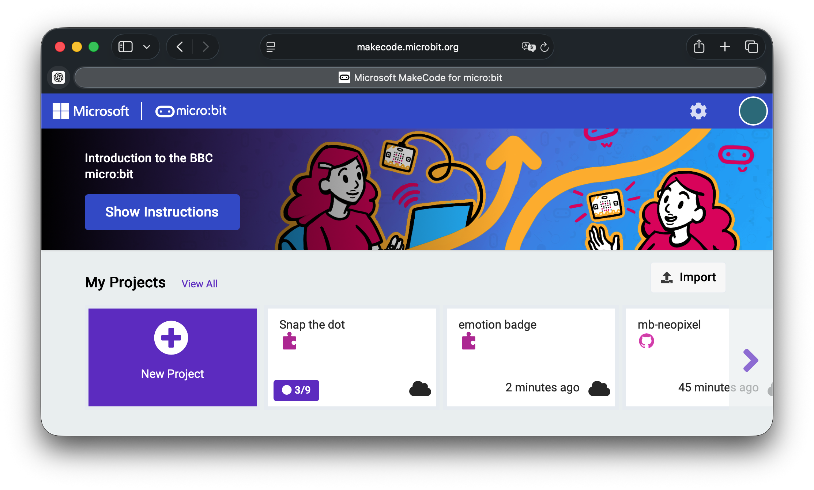
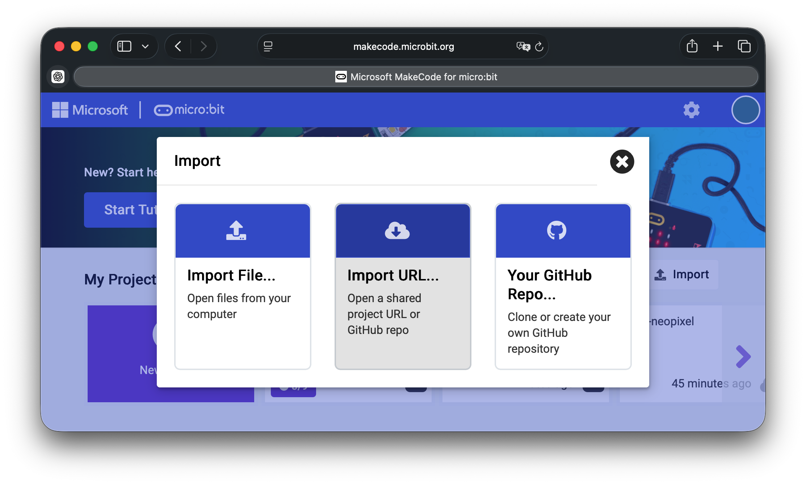
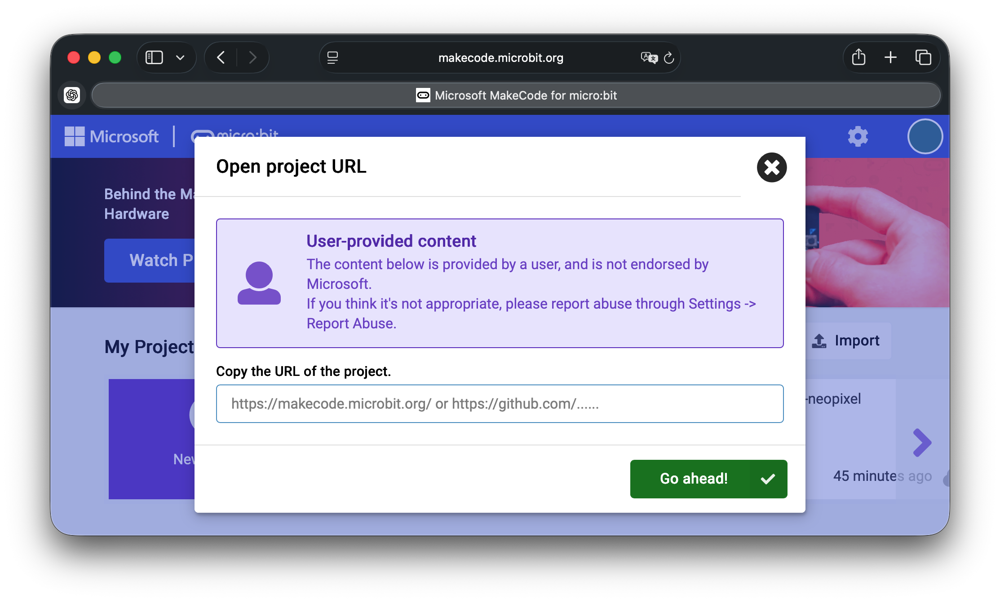

# mb-neopixel

This is a sample project that uses NeoPixel with the BBC micro:bit.
The lighting behavior is determined based on the values from the micro:bit’s
accelerometer.
This project uses the [MakeCode editor](https://makecode.microbit.org/#editor).

> Open this page at [https://youpong.github.io/mb-neopixcel/](https://youpong.github.io/mb-neopixcel/)

## Setup

### Import the project

Access the MakeCode website.


Click *Import*.



Select *Import URL...*



Enter the URL and click *Go ahead!*
https://github.com/youpong/mb-neopixel

### Edit main.ts

Modify the following constants to match your NeoPixel device.
For example, if the number of pixels is 8:
```ts
const PIXEL_NUM = 8;
```

### Download the program

Connect the micro:bit to your PC and download the program.

### Connecting the micro:bit and NeoPixel

Connect as follows.

| micro:bit | NeoPixel |
|-----------|----------|
| pin1      | SIG |
| 3V.       | VCC |
| GND       | GND |

## Use as Extension

This repository can be added as an **extension** in MakeCode.

* open [https://makecode.microbit.org/](https://makecode.microbit.org/)
* click on **New Project**
* click on **Extensions** under the gearwheel menu
* search for **https://github.com/youpong/mb-neopixcel** and import

## Edit this project

To edit this repository in MakeCode.

* open [https://makecode.microbit.org/](https://makecode.microbit.org/)
* click on **Import** then click on **Import URL**
* paste **https://github.com/youpong/mb-neopixcel** and click import

## License

MIT

#### Metadata (used for search, rendering)

* for PXT/microbit
<script src="https://makecode.com/gh-pages-embed.js"></script><script>makeCodeRender("{{ site.makecode.home_url }}", "{{ site.github.owner_name }}/{{ site.github.repository_name }}");</script>
